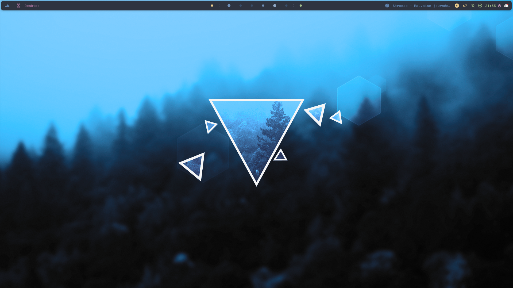
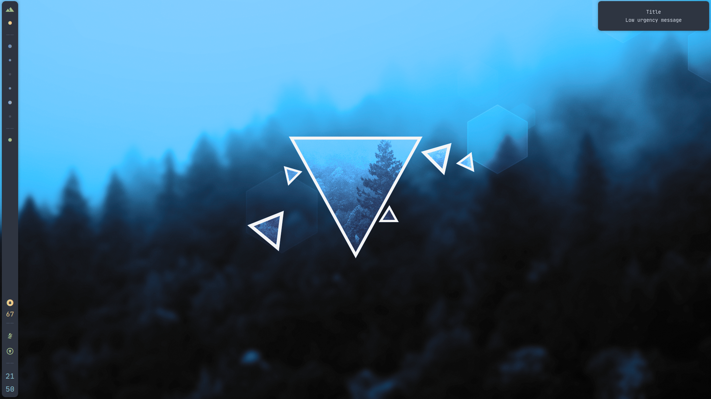
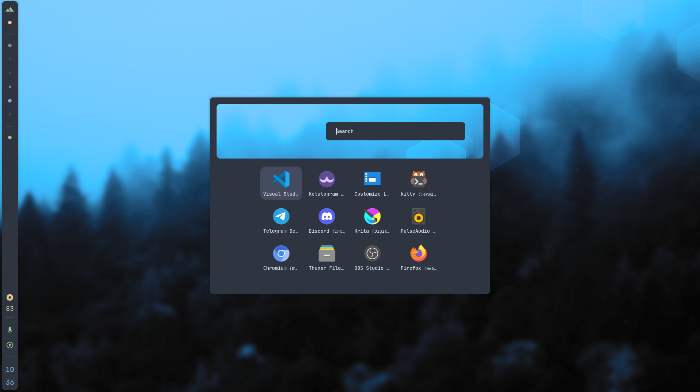
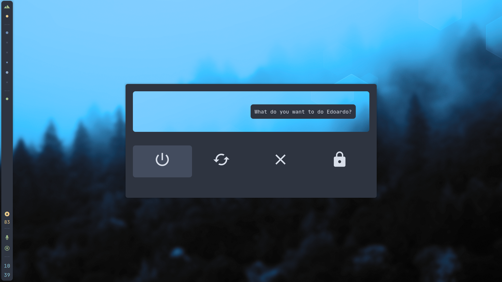
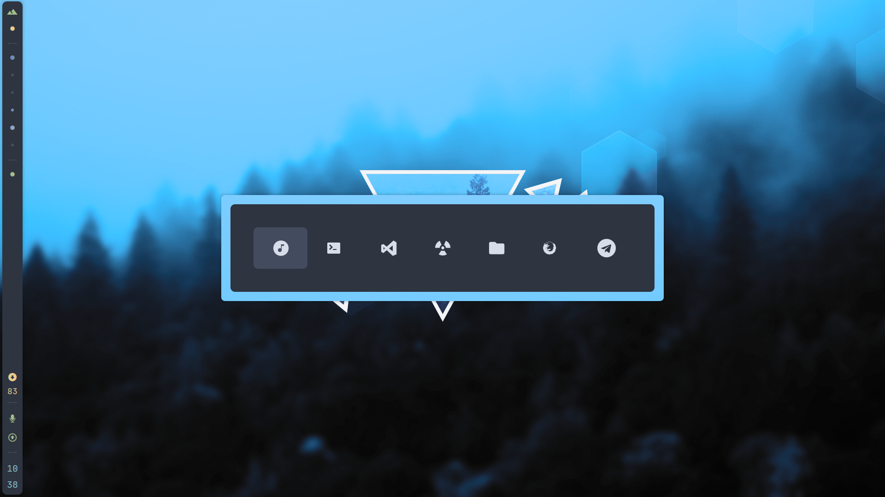
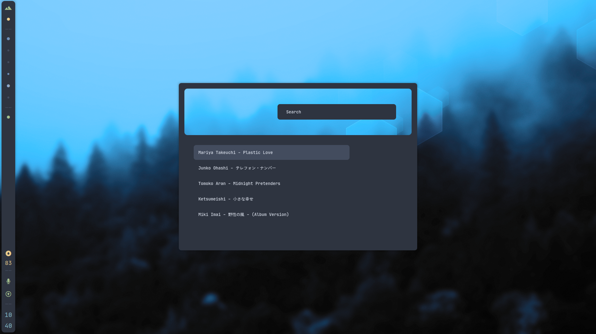

# Dotfiles

# Configurations
- [bspwm README](.config/bspwm/README.md)
- [sxhkd README](.config/sxhkd/README.md)
- [kitty README](.config/kitty/README.md)
- [polybar README](.config/polybar/README.md)
- [eww README](.config/eww/README.md)
- [dunst README](.config/dunst/README.md)
- [ncmpcpp README](.config/ncmpcpp/README.md)
- [discocss README](.config/discocss/README.md)
- [mopidy README](.config/mopidy/README.md)
- [picom README](.config/picom/README.md)
- [rofi README](.config/rofi/README.md)

# Screenshots

## EWW / WIDGETS

## Polybar

## Dunst

# Kitty

# ncmpcpp

## Discord

## Rofi

